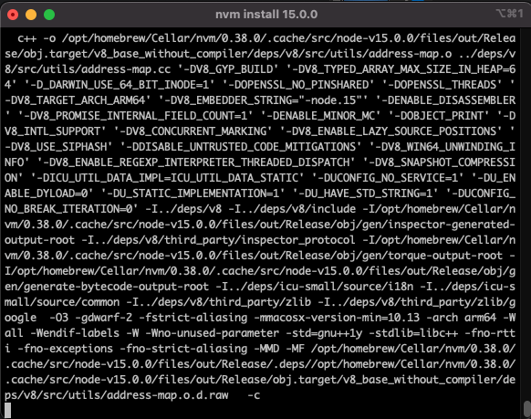
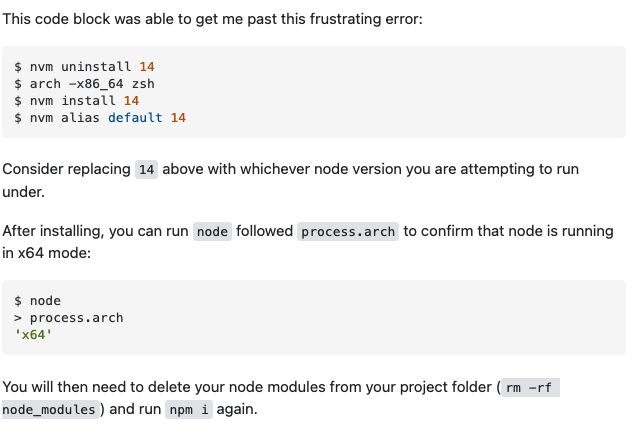
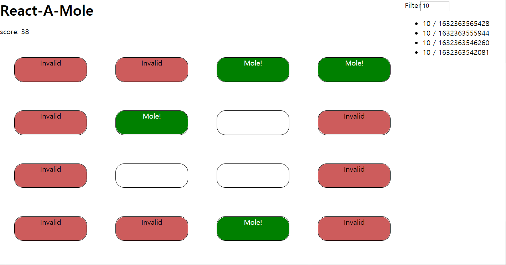

# 1. 환경 관련 오류 해결

Node Sass does not yet support your current environment: OS X Unsupported architecture (arm64) with Unsupported runtime (93)

노드 버전 다운그레이드
https://github.com/sass/node-sass/releases/tag/v5.0.0

nvm 설치
https://stackoverflow.com/questions/47009776/how-to-run-nvm-in-oh-my-zsh

node 15 설치 및 변경


```
nvm install 15
nvm use 15
```

`yarn install` 버전 호환..

```
nvm install 15.0.1
```

m1 호환성 문제로 또 다시 에러

https://stackoverflow.com/questions/65856300/wasm-code-commit-allocation-failed-process-out-of-memory

iterm rosetta로 실행 후 nvm으로 15.0.1 설치

rosetta에서 설치가 잘 안 돼서 14버전 다시 설치

```
$ nvm uninstall 14
$ arch -x86_64 zsh
$ nvm install 14
$ nvm alias default 14
```



# React-A-Mole

HealthHub DataLab coding test



## Tasks

### 1. Scoring

In `App.tsx`, we temporarily fixed the score presentation as `score: 0`.
We want the score to be _incremented (by 1) when user clicks a mole_.
Modify `onHit` and other necessary codes in `App.tsx` to correctly present the score.

You do not need to change files other than `App.tsx` for this task.

- keys: `useState`

### 2. Multiply components

There is only 1 mole hole now. Make it 16.

You do not need to change files other than `App.tsx` for this task.

### 3. `clearMole` handler

`useMole` is a [custom hook](https://reactjs.org/docs/hooks-custom.html) which returns

- `mole`: boolean flag which indicates mole is up or not
- `clearMole`: callback function upon striking a mole

Modify `useMole` hook in `mole.ts`:

1. `clearMole` should make `mole = false`
2. and schedule `mole` to be `true` after `1 + 10 * Math.random()` seconds

You do not need to change files other than `mole.ts` for this task.

- keys: `useEffect`, `setTimeout`

### 4. History & Filtering

We want to show all strike records of `"location / timestamp"`, and allow user to filter them
by location. Location is a 0-based index of each hole. Timestamp is `Date.now()` on each strike.

`History` component should show all records in timestamp descending order when the filter is empty.
When filter input is given, it should only show records which has a location equal to the input.

### 5. (Optional) Strike failure

Currently, each mole will stay up permanently until user clicks it.
We want each mole hole to become invalid (i.e., no mole would ever pop up again from it)
after 2 seconds have passed from a mole has popped up from the hole.
Invalid holes must be visibly distinguished.

Modify whichever parts of code you wish to change.
You can use `mole-fail` css class in `Mole.scss`.
